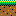

editor-readme

# How to make levels for Platformer (tentatively titled Super Swadge Land):

## Introduction
Super Swadge Land is a conventional 2D platformer action game. The base game mechanics are inspired by a certain funny mustachioed plumber wahoo game. However, while overcoming obstacle course-like levels is the primary goal, high score chasing is a highly encouraged (but not required) side goal. The combo multiplier advances with most actions: defeating enemies, collection coins, beaking brick blocks, collecting powerups, etc; thus adding hidden depth to each level!

## Prerequisites
- Aseprite v1.3 beta https://www.aseprite.org
    - Pixel art editor, paid software ($20)
    - Purchase will give you access to stable and beta versions
    - Choose the beta version, as that is currently the only one that supports tilemaps
- Level template file
    - https://github.com/AEFeinstein/Super-2023-Swadge-FW/blob/platformer/tools/platformer/editor/blank-template.aseprite
    - or make a copy of Level 1-1:
        - https://github.com/AEFeinstein/Super-2023-Swadge-FW/blob/platformer/tools/platformer/editor/level1-1.aseprite
- Aseprite script for exporting levels
    - https://github.com/AEFeinstein/Super-2023-Swadge-FW/blob/platformer/tools/platformer/editor/export-tilemap-binary.lua
    - Place in Aseprite Scripts folder
        - Use "File -> Scripts -> Open Scripts Folder" to access the folder.

## Usage:
1. Open the template file in Aesprite
2. If you don't see the Layers pane, add a new layer and then delete it to make it appear.
3. Select the Tilemap layer (may be named "Tilemap 1")
4. On the top left of the window, underneath the lock icon, make sure the brick icon button is pressed. (You should see the tileset instead of the color palette)
5. Click on a tile to select it, then draw in the canvas as you would in any pixel art editor!
6. You can place objects just like any other tile. See the tiles with ID of 128 and greater.
7. When you're done, use File -> Scripts -> export-tilemap-binary to export your level. Using the dialog box, select the filename/location to which it will be saved. Filenames must be limited to 12 characters including .bin extension!!
8. Place the exported file in assets/platformer/levels.
9. If you're overwriting an existing level file, delete the old version from the spiffs_image directory before building!

# General rules for level creation:
- Levels must be between 19x14 and 255x255 tiles in size. (Use Sprite -> Canvas Size to select a size)
- Every level must have exactly one START tile. This determines where the player starts.
- Every level must have at least one goal tile (dark green blocks with white lines and a letters from A to D, including a star).
- Tiles that look like boxes or circles with hex numbers are unimplemented. Don't use them.
- The player spawn tile (ID=128) actually will spawn another player object, and weird stuff will happen. Don't use it! If you are trying to set a start location for the player, use the START tile (ID=1).

# Tileset Reference
## Control tiles
### Empty
All empty spaces are represented with tile 0.

| Tile Id | Tile Name | Appearance in editor |
| --- | --- | --- |
| 0 | TILE_EMPTY | (no image) |

### Warp tiles
These tiles represent specific locations within the level to which the player can be teleported, usually by touching a Warp object.

In the editor they can either represent a warp entrance or warp destination, depending on what kind of tile it is placed above:
- When placed directly above a Container Block or Brick Block:
    - The Container Block or Brick Block will release a Warp Vortex that will
    send the player to the warp destination when touched.
- Otherwise:
    - Defines the corresponding warp destination. All level files will include 16 warp locations. If a warp destination is not defined, it will be set to 0,0.

Warp 0, a.k.a. the "START" tile, represents the starting location for the player in the level.

| Tile Id | Tile Name | Appearance in editor |
| --- | --- | --- |
| 1 | TILE_WARP_0 | (no image) |
| 2 | TILE_WARP_1 | (no image) |
| 3 | TILE_WARP_2 | (no image) |
| 4 | TILE_WARP_3 | (no image) |
| 5 | TILE_WARP_4 | (no image) |
| 6 | TILE_WARP_5 | (no image) |
| 7 | TILE_WARP_6 | (no image) |
| 8 | TILE_WARP_7 | (no image) |
| 9 | TILE_WARP_8 | (no image) |
| 10 | TILE_WARP_9 | (no image) |
| 11 | TILE_WARP_A | (no image) |
| 12 | TILE_WARP_B | (no image) |
| 13 | TILE_WARP_C | (no image) |
| 14 | TILE_WARP_D | (no image) |
| 15 | TILE_WARP_E | (no image) |
| 16 | TILE_WARP_F | (no image) |

### Container Block Content Tiles
When placed directly above a Container Block or Brick Block, that block will release the item denoted by the tile.

| Tile Id | Tile Name | Appearance in editor | Notes |
| --- | --- | --- | --- |
| 17 | TILE_CTNR_COIN | (no image) | The coin is added directly to the current total, rather than emerging from the block. |
| 18 | TILE_CTNR_10COIN | (no image) | (Unimplemented) |
| 19 | TILE_CTNR_POW1 | (no image) | The main powerup, "Gaming" or "Music" (depending on the player's current powerup state) |
| 20 | TILE_CTNR_POW2 | (no image) | (Unimplemented) |
| 21 | TILE_CTNR_POW3 | (no image) | (Unimplemented) |
| 22 | TILE_CTNR_1UP | (no image) | The 1UP heart. |

## Invisible Blocks

| Tile Id | Tile Name | Appearance in editor | Notes |
| --- | --- | --- | --- |
| 30 | TILE_INVISIBLE_BLOCK | (no image) | A solid invisible block. Use these to prevent the player from leaving the left or right side of the level. |
| 31 | TILE_INVISIBLE_CONTAINER_BLOCK | (no image) | An invisible version of Container Block. Can be activated from any direction. |

## Solid Tiles
The basic building blocks of any level. Objects cannot pass or fall through them.

| Tile Id | Tile Name | Appearance |
| --- | --- | --- |
| 32 | TILE_GRASS |  |
| 33 | TILE_GROUND |  |
| 34 | TILE_BRICK_BLOCK |  |
| 35 | TILE_BLOCK |  |
| 36 | TILE_METAL_BLOCK |  |
| 37 | TILE_METAL_PIPE_H |  |
| 38 | TILE_METAL_PIPE_V |  |
| 41 | TILE_GIRDER |  |

## Bounce Block
TBD

| Tile Id | Tile Name | Appearance | Notes |
| --- | --- | --- | --- |
| 39 | TILE_METAL_PIPE_HEND | | The name is wrong.|

## Goal Tiles
When the player lands on these the level is complete and the appropriate bonus is given.

| Tile Id | Tile Name | Appearance |
| --- | --- | --- |
| 59 | TILE_GOAL_100PTS |  |
| 60 | TILE_GOAL_500PTS |  |
| 61 | TILE_GOAL_1000PTS |  |
| 62 | TILE_GOAL_2000PTS |  |
| 63 | TILE_GOAL_5000PTS |  |

## Container Block
The standard Container Block. Can be activated from any direction. If a Container Block Content Tile is placed above, the block will yield that item when hit.

| Tile Id | Tile Name | Appearance |
| --- | --- | --- |
| 64 | TILE_CONTAINER_1 |  |
### Container Block Animation Tiles
Animation frames for the Container Block. Don't use these.

| Tile Id | Tile Name | Appearance |
| --- | --- | --- |
| 65 | TILE_CONTAINER_2 |  |
| 66 | TILE_CONTAINER_3 |  |
## Coin
A coin. If the player touches it, it will be collected.

| Tile Id | Tile Name | Appearance |
| --- | --- | --- |
| 67 | TILE_COIN_1 |  |
### Coin Animation Tiles
Animation frames for the Coin. Don't use these.

| Tile Id | Tile Name | Appearance |
| --- | --- | --- |
| 68 | TILE_COIN_2 |  |
| 69 | TILE_COIN_3 |  |

## Background tiles
Objects will pass through these tiles and not interact with them.

### Goal Zone Marker
Precede your Goal Block areas with these, so that the player knows to prerpare a jump to land on the highest value block possible.

| Tile Id | Tile Name | Appearance |
| --- | --- | --- |
| 80 | TILE_BG_GOAL_ZONE |  |

### Arrow Signs
Use these to direct the player when a level layout is potentially confusing.

| Tile Id | Tile Name | Appearance |
| --- | --- | --- |
| 81 | TILE_BG_ARROW_L |  | 
| 82 | TILE_BG_ARROW_R |  | 
| 83 | TILE_BG_ARROW_U |  | 
| 84 | TILE_BG_ARROW_D |  | 
| 85 | TILE_BG_ARROW_LU |  |
| 86 | TILE_BG_ARROW_RU |  |
| 87 | TILE_BG_ARROW_LD |  | 
| 88 | TILE_BG_ARROW_RD |  |

70. TILE_LADDER,
    - (Unimplemented, may not be included in this version of the game)

## Entity Spawn Location Tiles
When these tiles scroll into view, the corresponding entity will spawn at that location.
NOTE: if 16 entities are active, including the player, further entities will not be spawned until at least 1 becomes inactive.

### Scroll Lock Entities
Use these entities to prevent the screen from scrolling past a certain point in the level. This is useful to keep bonus areas hidden until the player warps into it.

The spawn tile must be scrolled onto the screen for it to take effect. It will immediately despawn in 1 frame after it changes tilemap scrolling parameters.

In the editor, the arrow will point to the line past which the screen will not be allowed to scroll.

| Tile Id | Entity Name | Appearance in editor |
| --- | ---| --- |
| 130 | ENTITY_SCROLL_LOCK_LEFT |  | 
| 131 | ENTITY_SCROLL_LOCK_RIGHT |  | 
| 132 | ENTITY_SCROLL_LOCK_UP |  |
| 133 | ENTITY_SCROLL_LOCK_DOWN |  |

### Scroll Unlock Entity
This entity unlocks scrolling in all directions after at least 1 scroll lock entity has set scrolling limits.

| Tile Id | Entity Name | Appearance in editor |
| --- | ---| --- |
| 134 | ENTITY_SCROLL_UNLOCK |  | 

### Enemies

#### Bush-like enemy (no name yet)
A basic enemy that walks forward, falls off ledges, and turns around at walls.

| Tile Id | Entity Name | Appearance | Notes |
| --- | ---| --- | --- |
| 129 | ENTITY_TEST |  | |
| 141 | ENTITY_BUSH_2 |  | Moves a little faster and turns around at platform edges. When it changes direction, it does a small hop. |
| 142 | ENTITY_BUSH_3 |  | Moves fast and randomly changes direction to avoid being stomped. When it changes direction, it does a small hop. |

#### Dust Bunny
A rabbit enemy that is a bit more difficult to stomp as it constantly jumps.

| Tile Id | Entity Name | Appearance | Notes |
| --- | ---| --- | --- |
| 139 | ENTITY_DUST_BUNNY |  | Jumps in place at random heights at random intervals. |
| 143 | ENTITY_DUST_BUNNY_2 |  | Jumps forward at random heights at more frequent intervals, turning around at walls. |
| 144 | ENTITY_DUST_BUNNY_3 |  | Jumps at random heights at random intervals, always moving towards the player. |

#### Wasp
An aggressive enemy that flies through the air, dropping rapidly to the ground in attempt to attack an approaching player below.
Note: If the player is above the wasp, it will not attack.

| Tile Id | Entity Name | Appearance | Notes |
| --- | ---| --- | --- |
| 140 | ENTITY_WASP |  | Flies slowly and attacks when the player is within a few blocks horizontally from itself. Always returns to its original flying height before resuming horizontal flight. |
| 145 | ENTITY_WASP_2 |  | Flies a little bit more quickly and ttacks when the player is within a random number of blocks horizontally from itself. Always returns to its original flying height before resuming horizontal flight. |
| 146 | ENTITY_WASP_3 |  | Flies a quickly towards the player and ttacks when the player is within a close of blocks horizontally from itself. Rises to a random flying height before resuming horizontal flight. |

### Background Color Control Entities
Changes the background color to its specified color when its spawn tile is scrolled onto the screen.
Use it to apply a sky color background and to change it to a color that gives the impression of being underground or indoors.

Note: the color shown in the editor does not match the exact color shown in-game. See the hex values below.

| Tile Id | Entity Name | Appearance in editor | Actual color hex value | Notes |
| --- | ---| --- | --- | --- |
| 147 | ENTITY_BGCOL_BLUE |  | | |
| 148 | ENTITY_BGCOL_YELLOW |  | | |
| 149 | ENTITY_BGCOL_ORANGE |  | | |
| 150 | ENTITY_BGCOL_PURPLE |  | | |
| 151 | ENTITY_BGCOL_DARK_PURPLE |  | | |
| 152 | ENTITY_BGCOL_BLACK |  | | |
| 153 | ENTITY_BGCOL_NEUTRAL_GREEN |  | | Color is likely to be changed to a completely different color. |
| 154 | ENTITY_BGCOL_DARK_GREEN |  | | Color is likely to be changed to a completely different color. |

### Checkpoint Entity
Places a checkpoint flag into the level. Must be placed directly underneath TILE_WARPx tile to function! The player will respawn at that warp if the flag is activated.

| Tile Id | Entity Name | Appearance in editor |
| --- | ---| --- |
| 158 | ENTITY_CHECKPOINT | |

## Don't Place the Following Entities using the Editor.

| Tile Id | Entity Name | Appearance in editor | Notes |
| --- | ---| --- | --- | 
| 128 | ENTITY_PLAYER |  | Use TILE_WARP_0 (The START tile) instead. Otherwise weird stuff will happen. |
| 135 | ENTITY_HIT_BLOCK |  | The object that makes a Container Block or Brick Block look like it's bouncing. Useless if placed from the editor. |
| 136 | ENTITY_DEAD |  | Represents a defeated player or enemy. Useless if placed from the editor. |
| 137 | ENTITY_POWERUP |  | The "Gaming" or "Music" powerup dropped by TILE_CTNR_POW1. |
| 138 | ENTITY_WARP |  | Warp vortex dropped using the TILE_WARPx control tiles. Won't work properly if placed directly using the editor. |
| 156 | ENTITY_1UP |  | The 1UP Heart dropped by TILE_CTNR_1UP. Just use that instead, please. |
| 157 | ENTITY_WAVE_BALL |  | The Square-wave Ball thrown by the player by pressing the B button at 3 HP. Why would you place this directly into a level? |
