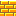

editor-readme

# How to make levels for Platformer (tentatively titled Super Swadge Land):

## Prerequisites
- Aseprite v1.3 beta https://www.aseprite.org
    - Pixel art editor, paid software ($20)
    - Purchase will give you access to stable and beta versions
    - Choose the beta version, as that is currently the only one that supports tilemaps
- Level template file
    - https://github.com/AEFeinstein/Super-2023-Swadge-FW/blob/platformer/tools/platformer/editor/blank-template.aseprite
    - or make a copy of Level 1-1:
        - https://github.com/AEFeinstein/Super-2023-Swadge-FW/blob/platformer/tools/platformer/editor/level1-1.aseprite
- Aseprite script for exporting levels
    - https://github.com/AEFeinstein/Super-2023-Swadge-FW/blob/platformer/tools/platformer/editor/export-tilemap-binary.lua
    - Place in Aseprite Scripts folder
        - Use "File -> Scripts -> Open Scripts Folder" to access the folder.

## Usage:
1. Open the template file in Aesprite
2. If you don't see the Layers pane, add a new layer and then delete it to make it appear.
3. Select the Tilemap layer (may be named "Tilemap 1")
4. On the top left of the window, underneath the lock icon, make sure the brick icon button is pressed. (You should see the tileset instead of the color palette)
5. Click on a tile to select it, then draw in the canvas as you would in any pixel art editor!
6. You can place objects just like any other tile. See the tiles with ID of 128 and greater.
7. When you're done, use File -> Scripts -> export-tilemap-binary to export your level. Using the dialog box, select the filename/location to which it will be saved. Filenames must be limited to 12 characters including .bin extension!!
8. Place the exported file in assets/platformer/levels.
9. If you're overwriting an existing level file, delete the old version from the spiffs_image directory before building!

# General rules for level creation:
- Levels must be between 19x14 and 255x255 tiles in size. (Use Sprite -> Canvas Size to select a size)
- Every level must have exactly one START tile. This determines where the player starts.
- Every level must have at least one goal tile (dark green blocks with white lines and a letters from A to D, including a star).
- Tiles that look like boxes or circles with hex numbers are unimplemented. Don't use them.
- The player spawn tile (ID=128) actually will spawn another player object, and weird stuff will happen. Don't use it! If you are trying to set a start location for the player, use the START tile (ID=1).

# Tileset Reference
## Control tiles
### Empty
All empty spaces are represented with tile 0.

| Tile Id | Tile Name | Appearance in editor |
| --- | --- | --- |
| 0 | TILE_EMPTY | (no image) |

### Warp tiles
These tiles represent specific locations within the level to which the player can be teleported, usually by touching a Warp object.

In the editor they can either represent a warp entrance or warp destination, depending on what kind of tile it is placed above:
- When placed directly above a Container Block or Brick Block:
    - The Container Block or Brick Block will release a Warp Vortex that will
    send the player to the warp destination when touched.
- Otherwise:
    - Defines the corresponding warp destination. All level files will include 16 warp locations. If a warp destination is not defined, it will be set to 0,0.

Warp 0, a.k.a. the "START" tile, represents the starting location for the player in the level.

| Tile Id | Tile Name | Appearance in editor |
| --- | --- | --- |
| 1 | TILE_WARP_0 | (no image) |
| 2 | TILE_WARP_1 | (no image) |
| 3 | TILE_WARP_2 | (no image) |
| 4 | TILE_WARP_3 | (no image) |
| 5 | TILE_WARP_4 | (no image) |
| 6 | TILE_WARP_5 | (no image) |
| 7 | TILE_WARP_6 | (no image) |
| 8 | TILE_WARP_7 | (no image) |
| 9 | TILE_WARP_8 | (no image) |
| 10 | TILE_WARP_9 | (no image) |
| 11 | TILE_WARP_A | (no image) |
| 12 | TILE_WARP_B | (no image) |
| 13 | TILE_WARP_C | (no image) |
| 14 | TILE_WARP_D | (no image) |
| 15 | TILE_WARP_E | (no image) |
| 16 | TILE_WARP_F | (no image) |

### Container Block Content Tiles
When placed directly above a Container Block or Brick Block, that block will release the item denoted by the tile.

| Tile Id | Tile Name | Appearance in editor | Notes |
| --- | --- | --- | --- |
| 17 | TILE_CTNR_COIN | (no image) | The coin is added directly to the current total, rather than emerging from the block. |
| 18 | TILE_CTNR_10COIN | (no image) | (Unimplemented) |
| 19 | TILE_CTNR_POW1 | (no image) | The main powerup, "Gaming" or "Music" (depending on the player's current powerup state) |
| 20 | TILE_CTNR_POW2 | (no image) | (Unimplemented) |
| 21 | TILE_CTNR_POW3 | (no image) | (Unimplemented) |
| 22 | TILE_CTNR_1UP | (no image) | The 1UP heart. |

### Invisible Blocks

| Tile Id | Tile Name | Appearance in editor | Notes |
| --- | --- | --- | --- |
| 30 | TILE_INVISIBLE_BLOCK | (no image) | A solid invisible block. Use these to prevent the player from leaving the left or right side of the level. |
| 31 | TILE_INVISIBLE_CONTAINER_BLOCK | (no image) | An invisible version of Container Block. Can be activated from any direction. |

### Solid Tiles
The basic building blocks of any level. Objects cannot pass or fall through them.

| Tile Id | Tile Name | Appearance |
| --- | --- | --- | --- |
| 32 | TILE_GRASS |  |
| 33 | TILE_GROUND |  |
| 34 | TILE_BRICK_BLOCK |  |
| 35 | TILE_BLOCK |  |
| 36 | TILE_METAL_BLOCK |  |
| 37 | TILE_METAL_PIPE_H |  |
| 38 | TILE_METAL_PIPE_V |  |
| 41 | TILE_GIRDER |  |

### Bounce Block
TBD

### Goal Tiles
When the player lands on these the level is complete and the appropriate bonus is given.

| Tile Id | Tile Name | Appearance |
| --- | --- | --- | --- |
| 59 | TILE_GOAL_100PTS |  |
| 60 | TILE_GOAL_500PTS |  |
| 61 | TILE_GOAL_1000PTS |  |
| 62 | TILE_GOAL_2000PTS |  |
| 63 | TILE_GOAL_5000PTS |  |

### Container Block
The standard Container Block. Can be activated from any direction. If a Container Block Content Tile is placed above, the block will yield that item when hit.

| Tile Id | Tile Name | Appearance |
| --- | --- | --- | --- |
| 64 | TILE_CONTAINER_1 |  |
#### Container Block Animation Tiles
Animation frames for the Container Block. Don't use these.

| Tile Id | Tile Name | Appearance |
| --- | --- | --- | --- |
| 65 | TILE_CONTAINER_2 |  |
| 66 | TILE_CONTAINER_3 |  |
### Coin
A coin. If the player touches it, it will be collected.

| Tile Id | Tile Name | Appearance |
| --- | --- | --- | --- |
| 67 | TILE_COIN_1 |  |
#### Coin Animation Tiles
Animation frames for the Coin. Don't use these.

| Tile Id | Tile Name | Appearance |
| --- | --- | --- | --- |
| 68 | TILE_COIN_2 |  |
| 69 | TILE_COIN_3 |  |

### Background tiles
Objects will pass through these tiles and not interact with them.

#### Goal Zone Marker
Precede your Goal Block areas with these, so that the player knows to prerpare a jump to land on the highest value block possible.

| Tile Id | Tile Name | Appearance |
| --- | --- | --- |
| 80 | TILE_BG_GOAL_ZONE |  |

#### Arrow Signs
Use these to direct the player when a level layout is potentially confusing.

| Tile Id | Tile Name | Appearance |
| --- | --- | --- |
| 81 | TILE_BG_ARROW_L |  | 
| 82 | TILE_BG_ARROW_R |  | 
| 83 | TILE_BG_ARROW_U |  | 
| 84 | TILE_BG_ARROW_D |  | 
| 85 | TILE_BG_ARROW_LU |  |
| 86 | TILE_BG_ARROW_RU |  |
| 87 | TILE_BG_ARROW_LD |  | 
| 88 | TILE_BG_ARROW_RD |  |

70. TILE_LADDER,
    - (Unimplemented, may not be included in this version of the game)

### object spawn locations

128. ENTITY_PLAYER
    - Spawns a player object. Weird stuff will happen. Don't use it! If you are trying to set a start location for the player, use the START tile (ID=1).
129. ENTITY_TEST
    - Simple stompable enemy. Walks slowly along platforms. Will turn around when it reaches a wall.
130. ENTITY_SCROLL_LOCK_LEFT
131. ENTITY_SCROLL_LOCK_RIGHT,
132. ENTITY_SCROLL_LOCK_UP,
133. ENTITY_SCROLL_LOCK_DOWN
    - When spawned, prevents the screen from scrolling past the specified area. The arrow points to the horizontal or vertical line where the screen will be stopped.
134. ENTITY_SCROLL_UNLOCK
    - When spawned, unlocks screen so it can scroll anywhere.
135. ENTITY_HIT_BLOCK
    - The object that makes a Container Block or Brick Block look like it's bounciung. Don't place it with the editor. 
136. ENTITY_DEAD
    - Represents a defeated player or enemy. Don't place it with the editor.
137. ENTITY_POWERUP
    - Powerup dropped by TILE_CTNR_POW1.
138. ENTITY_WARP
    - Warp vortex dropped using the TILE_WARPx control tiles.
139. ENTITY_DUST_BUNNY
    - A stompable bunny enemy that moves only by jumping at random intervals and random angles. Turns around at walls.
140. ENTITY_WASP
    - A stompable wasp enemy that flies through the air, unaffected by gravity until the player passes underneath it, at which point it will drop straight down. After dropping down, it will stop for a short time when it meets a block, then fly back up. Turns around at walls.
